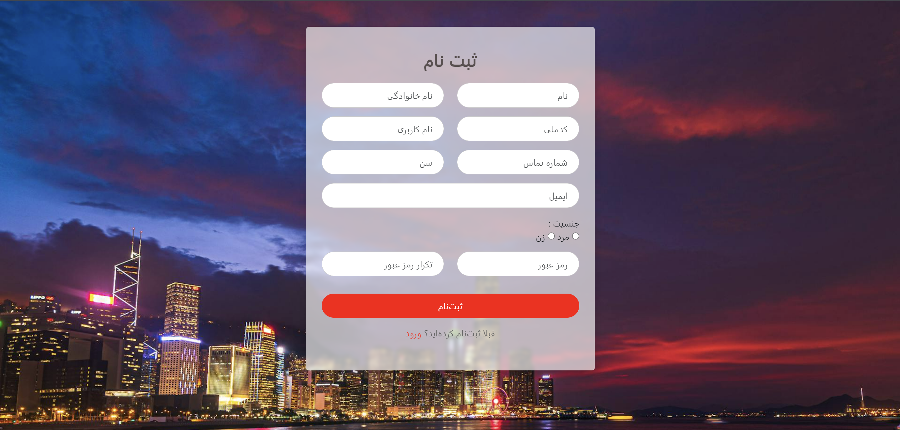

# Preview


# Project Title
A brief description of your project goes here.

## Technologies Used
This project is built with:
- 
- 
- 


## Installation
Steps to install and run the project.

```bash
# Clone the repository
git clone https://github.com/username/repository.git

# Navigate to the project folder
cd repository

# Open the project in a browser
open index.html

